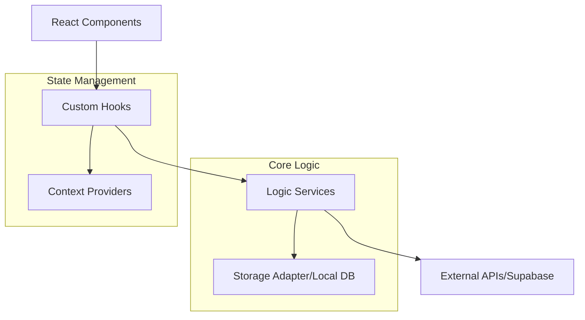

# Architecture Notes

The system is architected as a modular React application with a strong emphasis on separation of concerns. The design facilitates a clear distinction between the presentation layer (UI components), state management (custom hooks and providers), and core business logic (services). 

The system's architecture is evolved to support both a high-traffic public news portal and a complex administrative dashboard. The decision to use a layered approach allows for independent scaling of UI features while maintaining a centralized logic core for handling data persistence, authentication, and external integrations (like video hosting and cloud storage). The codebase uses a "Service-Hook-Component" pattern where services handle raw data/APIs, hooks orchestrate local state and side effects, and components focus on rendering.

## System Architecture Overview

The system follows a **Modular Client-Side Monolith** topology, built primarily on React and Vite. While the frontend acts as a single cohesive unit, it is partitioned into distinct domains: Admin, News Detail, and User Engagement.

1.  **Request Flow**: Requests are handled by the React Router (implicit in entry points), which resolves to specific page components in `src/app` or `src/components-pages`.
2.  **Control Pivot**: Control flows from UI components to **Custom Hooks** (acting as Controllers) which manage state transitions. These hooks interact with **Services** for any persistence or external computation.
3.  **Deployment**: The system is designed for static hosting (Vercel/Netlify) with a heavy reliance on BaaS (Backend-as-a-Service) providers like Supabase for data and Cloudinary for media assets.

## Architectural Layers

- **Components**: UI elements and views organized by domain (`src/components/`, `src/components-pages/`).
- **Services**: Core business logic, API clients, and infrastructure abstractions (`src/services/`).
- **Controllers/Providers**: React Context providers and custom hooks that manage global and local application state (`src/providers/`, `src/hooks/`).
- **Models & Types**: Domain-driven TypeScript interfaces and schemas defining the system's data structures (`src/types/`, `src/components/admin/editor/schema/`).
- **Generators**: Specialized logic for constructing dynamic content like popups or playback segments (`src/components/admin/advertisers/popupBuilder/`, `src/utils/smartPlaybackGenerator.ts`).
- **Utilities**: Shared helper functions for cross-cutting concerns like validation and formatting (`src/utils/`).

> See [`codebase-map.json`](./codebase-map.json) for complete symbol counts and dependency graphs.

## Detected Design Patterns

| Pattern | Confidence | Locations | Description |
|---------|------------|-----------|-------------|
| **Provider** | 100% | `src/providers/` | Manages global state for Auth, App Control, and Dialogs. |
| **Adapter** | 90% | `StorageAdapter` | Wraps Browser storage (IndexedDB/localStorage) for offline capabilities. |
| **Singleton/Service** | 95% | `PlatformService`, `OfflineService` | Provides centralized, stateless or globally stateful logic containers. |
| **Observer** | 85% | `ActivityListener`, `LogListener` | Used for notification systems and debug logging events. |
| **Strategy** | 80% | `src/components/admin/editor/blocks/render/` | Different renderers selected based on content block types. |

## Entry Points

- [src/App.tsx](../src/App.tsx): The main React application entry point.
- [src/app/layout.tsx](../src/app/layout.tsx): The root layout definition for the application structure.
- [src/app/page.tsx](../src/app/page.tsx): The primary landing page entry.
- [src/providers/AppControllerProvider.tsx](../src/providers/AppControllerProvider.tsx): The main orchestration provider for application state.

## Public API

| Symbol | Type | Location |
|--------|------|----------|
| `PlatformService` | Class | `src/services/platformService.ts` |
| `OfflineService` | Class | `src/services/offlineService.ts` |
| `AppControllerProvider` | Function (Provider) | `src/providers/AppControllerProvider.tsx` |
| `useApp` | Hook | `src/providers/AppControllerProvider.tsx` |
| `NewsItem` | Interface | `src/types/news.ts` |
| `Advertiser` | Interface | `src/types/ads.ts` |
| `User` | Interface | `src/types/users.ts` |
| `cn` | Function (Util) | `src/utils/cn.ts` |

## Internal System Boundaries

The system maintains a strict boundary between the **Admin Domain** and the **Public Domain**. 
- **Data Ownership**: Admin components in `src/components/admin` own the mutation logic for news and advertisements. 
- **Synchronization**: The `OfflineService` and `StorageAdapter` act as a synchronization layer between the local UI state and the remote database, ensuring rascunhos (drafts) are preserved.
- **Contract Enforcement**: Shared types in `src/types` act as the contract between the Editor (Admin) and the Renderer (Public).

## External Service Dependencies

- **Supabase**: Primary database and authentication provider.
- **Cloudinary**: Used for video uploads and media transformation (`cloudinaryVideoService.ts`).
- **YouTube/Vimeo**: External video hosting providers integrated via `youtubeService.ts` and `ChromaKeyVideo.tsx`.
- **Browser APIs**: IndexedDB and LocalStorage for offline-first capabilities.

## Key Decisions & Trade-offs

1.  **Heavy Hook Usage**: Logic is predominantly placed in custom hooks rather than service classes to leverage React's lifecycle and reactivity directly. 
2.  **Schema-Driven Editor**: The news editor uses a block-based schema (`src/components/admin/editor/schema/`), allowing for flexible content structures at the cost of increased rendering complexity.
3.  **Offline-First Admin**: The implementation of `OfflineService` suggests a decision to prioritize admin productivity in low-connectivity environments, adding complexity to the storage layer.

## Diagrams

## Risks & Constraints

- **Client-Side Heavy**: As a SPA, initial load times may increase as the number of admin features grows.
- **Dependency Coupling**: High reliance on specific SaaS providers (Cloudinary/Supabase) makes migration to alternative backends a significant undertaking.
- **Performance**: Large news items with multiple media blocks may require optimization in the React rendering cycle (memoization is used in various components).

## Top Directories Snapshot

- **src/components**: ~150 files (Primary UI and domain-specific logic)
- **src/services**: ~20 files (Backend integrations and core logic)
- **src/types**: ~15 files (Centralized type definitions)
- **src/utils**: ~12 files (Shared utility functions)
- **src/hooks**: ~15 files (Generic state controllers)

## Related Resources

- [Project Overview](./project-overview.md)
- [Data Flow Documentation](./data-flow.md)
- [Codebase Map](./codebase-map.json)
