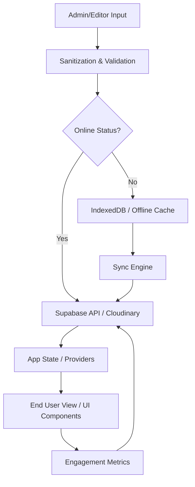

# Data Flow & Integrations

The system is designed as a content-driven platform where data originates from three primary sources: Administrative input (Content Management), User Interactions (Engagement), and External Providers (Media/Social). 

Data enters the system via the `Admin` dashboards and the `NewsEditor`, where it is sanitized and structured before being persisted to the backend (Supabase). For users, data is consumed through the `AppView` which reactively updates based on the current application state. The flow follows a unidirectional pattern where services act as the single source of truth for state transitions, ensuring that UI components only reflect the data provided by the service layer.

## Module Dependencies

- **src/app** → `hooks`, `providers`, `services`, `components`
- **src/components** → `hooks`, `utils`, `types`, `services`
- **src/hooks** → `services`, `types`, `utils`
- **src/services** → `utils`, `types`, `constants`
- **src/providers** → `services`, `hooks`, `types`
- **src/types** → (Leaf module, no internal dependencies)

## Service Layer

The service layer abstracts the complexity of data persistence, external API communication, and business logic.

- **[PlatformService](..\src\services\platformService.ts)**: Core utility for managing platform-specific configurations and network status.
- **[OfflineService](..\src\services\offlineService.ts)**: Manages local data persistence, draft synchronization, and IndexedDB interactions.
- **[EngagementService](..\src\services\engagement\engagementService.ts)**: Handles user interactions, polls, and social feedback loops.
- **[CloudinaryVideoService](..\src\services\upload\cloudinaryVideoService.ts)**: Manages media uploads, progress tracking, and asset optimization.
- **[YoutubeService](..\src\services\youtubeService.ts)**: Handles metadata extraction and integration with external video content.
- **[SanitizationService](..\src\services\sanitizationService.ts)**: Ensures data integrity and security before persistence.
- **[ActivityNotifications](..\src\services\activityNotifications.ts)**: Manages the internal event bus for system-wide updates.

## High-level Flow

The primary data pipeline follows a structured path from administrative creation to end-user consumption:

1.  **Input & Validation**: Data is captured via React Hook Form in the Admin UI and passed through `sanitizationService`.
2.  **Persistence**: The `OfflineService` checks connectivity. If online, data is sent to the remote database; otherwise, it is queued in IndexedDB.
3.  **Distribution**: Changes are propagated through `AppControllerProvider` which updates the global state.
4.  **Consumption**: Components subscribe to state changes via hooks like `useApp`, rendering the updated content.

## Internal Movement

Modules collaborate primarily through **React Context Providers** and a **Centralized Service Layer**.

- **Events**: The `ActivityNotifications` service implements a listener pattern allowing components to react to system events (e.g., "Post Published", "Upload Failed") without direct coupling.
- **State Propagation**: The `AppControllerProvider` acts as the primary orchestrator, holding the current `AppView` and distributing data to sub-providers like `DialogProvider` and `ToastProvider`.
- **Persistence Strategy**: Data is moved from volatile memory (React State) to semi-permanent storage (IndexedDB) via the `OfflineService` to prevent data loss during session interruptions.

## External Integrations

- **Supabase (Backend-as-a-Service)**:
    - **Purpose**: Primary database, authentication, and real-time subscriptions.
    - **Auth**: JWT-based session management handled via `useAuth`.
    - **Retry Strategy**: Exponential backoff implemented in the networking layer.
- **Cloudinary (Media Management)**:
    - **Purpose**: Video and image hosting, transformations, and streaming.
    - **Payload**: Form-data uploads with signed presets for security.
- **YouTube/Vimeo (External Media)**:
    - **Purpose**: Embedding third-party content and fetching metadata.
    - **Integration**: OEmbed and custom scrapers in `youtubeService.ts`.

## Observability & Failure Modes

- **Logging**: The `DebugLogger` class provides structured logging levels (Info, Warn, Error) and can be configured to pipe logs to an external monitoring service.
- **Error Boundaries**: The `ErrorBoundary` component wraps major UI sections (News Detail, Admin Panels) to catch runtime exceptions and provide fallback UI states.
- **Failure Recovery**:
    - **Network Interruption**: `NetworkService` detects offline states, triggering the UI to show cached content and queueing outgoing mutations.
    - **Data Inconsistency**: The `OfflineService` performs version checks on drafts to prevent overwriting newer remote data with stale local copies.
    - **Media Uploads**: `CloudinaryVideoService` provides progress callbacks and allows for chunked upload resumption.

## Related Resources

- [architecture.md](./architecture.md)
